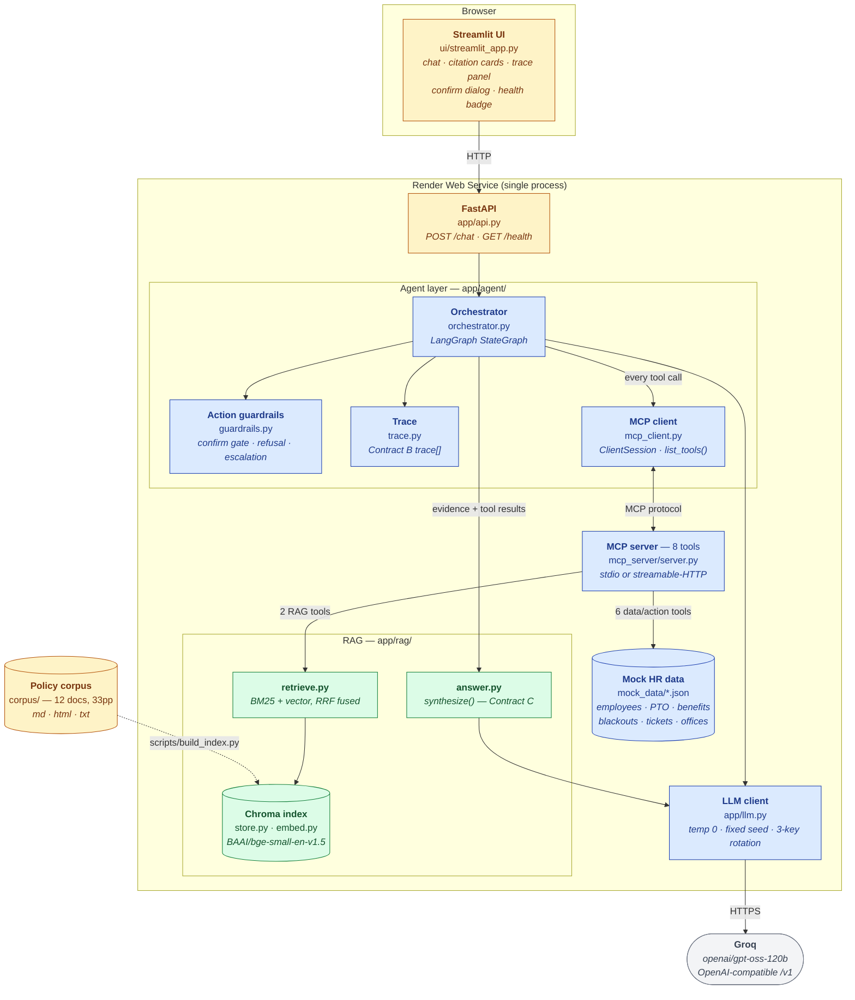
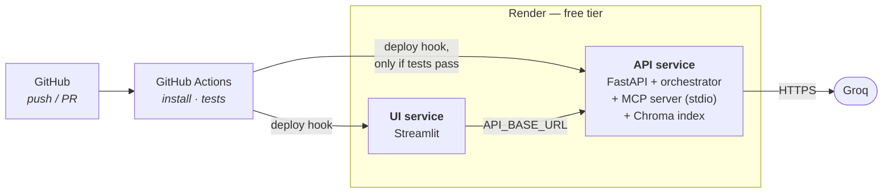

# Architecture

Rubric item 10 asks for a diagram showing seven components: the web app, agent
orchestrator, MCP client, MCP server(s), RAG index, mock structured data, and the
LLM provider. All seven are below, with the file that implements each.

Mermaid renders natively on GitHub, so this stays in version control and cannot
drift from the code the way an exported image would.

---

## The whole system



<sub>**Blue** = Chris (agent & MCP spine) · **green** = Rob (knowledge & evidence) ·
**amber** = Eric (UI, API, corpus) · **grey** = external.</sub>

---

## One turn, end to end

```mermaid
sequenceDiagram
    autonumber
    actor U as User
    participant API as FastAPI
    participant O as Orchestrator
    participant C as MCP client
    participant S as MCP server
    participant R as retrieve.py
    participant A as synthesize()
    participant G as Groq

    U->>API: POST /chat
    API->>O: question + employee_id
    O->>G: classify intent
    G-->>O: workflow

    loop max 6 steps
        O->>G: which tool next?
        G-->>O: tool call
        O->>C: call(tool, args)
        C->>S: MCP request
        alt RAG tool
            S->>R: retrieve / get_section
            R-->>S: chunks
        else data or action tool
            S->>S: read mock_data
        end
        S-->>C: payload (never raises)
        C-->>O: ToolCall + latency
        Note over O: guardrails check;<br/>a pending write ends the turn
    end

    O->>A: evidence + tool results
    A->>G: write the answer
    G-->>A: prose
    A-->>O: answer + citations + basis
    O-->>API: Contract B envelope
    API-->>U: answer · citations · trace
```

---

## The seven components

| # | Component | Implementation | Notes |
|---|---|---|---|
| 1 | **Web app** | `ui/streamlit_app.py`, `app/api.py` | Chat, citation cards, collapsible trace panel, confirmation dialog, health badge, two "Run demo task" buttons |
| 2 | **Agent orchestrator** | `app/agent/orchestrator.py` | LangGraph `StateGraph`. `classify → retrieve \| agent ⇄ tools → synthesize`, capped at 6 tool steps |
| 3 | **MCP client** | `app/agent/mcp_client.py` | Real `ClientSession`, `list_tools()` discovery at startup, transport by `MCP_TRANSPORT` |
| 4 | **MCP server** | `mcp_server/server.py` | 8 tools, dual transport (stdio / streamable-HTTP) |
| 5 | **RAG index** | `app/rag/` + Chroma | `BAAI/bge-small-en-v1.5` via fastembed; BM25 + vector fused by RRF |
| 6 | **Mock structured data** | `mock_data/*.json` | 12 employees, PTO, benefits, blackouts, tickets, offices |
| 7 | **LLM provider** | `app/llm.py` → Groq | `openai/gpt-oss-120b`, temperature 0, fixed seed, rotation across 3 keys |

### The eight MCP tools

| Tool | Backed by | Notes |
|---|---|---|
| `search_policy_documents` | `app/rag/retrieve.py` | Hybrid retrieval, RRF, max 2 chunks per document |
| `get_policy_section` | `app/rag/retrieve.py` | Full unchunked section by `doc_id` + `section_id` |
| `lookup_employee_profile` | `mock_data/employees.json` | Location resolved through `offices.json` |
| `check_pto_balance` | `mock_data/pto_balances.json` | Blackout windows scoped to the employee's department |
| `lookup_benefits_status` | `mock_data/benefits_elections.json` | |
| `check_policy_compliance` | composite | Structured verdict plus `policy_refs` |
| `create_mock_hr_ticket` | `mock_data/hr_tickets.json` | **Confirmation-gated** |
| `draft_hr_email` | — | **Confirmation-gated.** Never sends; there is no send path |

---

## Four boundaries that are load-bearing

**The agent never imports a tool function.** Everything goes through `MCPClient`
over a real session. The brief says hard-coded direct calls don't count, and an
import would work perfectly while silently forfeiting that. A test walks the AST of
everything under `app/agent/` and fails if `mcp_server` appears in an import.

**Tools never raise across the MCP boundary.** They return `{"error", "message"}`
so the orchestrator can degrade rather than the turn dying. The one place that does
raise is `discover()` — a client that never discovered anything is misconfigured,
not degraded, and an empty tool list would let the app report healthy with nothing
to call.

**The guardrail split.** Rob owns *evidence* guardrails — don't assert what the
corpus doesn't support. Chris owns *action* guardrails — don't act without
authority. The confirm token is minted and verified server-side because the server
performs the write; the agent-side policy (which tools are gated, what the user is
shown, that a pending write ends the turn) lives in `guardrails.py`. A gate only in
the agent could be bypassed by calling the tool directly; a gate only in the server
would leave the agent with no idea it should stop and ask.

**Traces are operational, never reasoning.** The brief forbids exposing
chain-of-thought. `trace.py` rejects any step carrying a reasoning-shaped field
outright, and redacts `confirm_token` from recorded arguments — a trace panel
renders in a browser and gets pasted into bug reports.

---

## Deployment



Two free Web Services. The MCP server runs **in-process** with the API over stdio —
the architecture the brief recommends for free-tier hosting — and `MCP_TRANSPORT`
switches it to `streamable-http` if it is ever split out.

Free instances are **512 MB RAM** and spin down after 15 minutes idle with a
~1 minute cold start. The 750 monthly instance hours are **shared across both
services**, not per service. Details and the measurements in
`docs/DEPLOYMENT-NOTES.md`.
