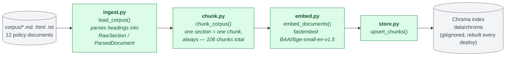
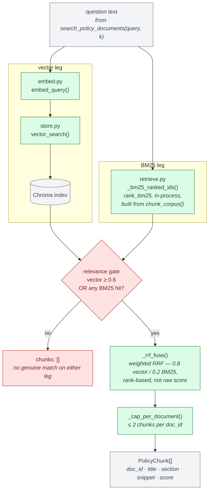
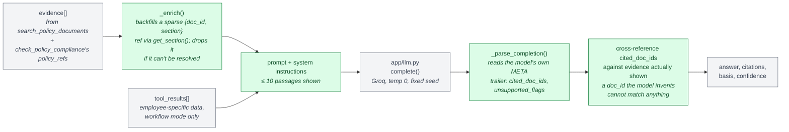

# RAG pipeline

The seven-component diagram in [`ARCHITECTURE.md`](ARCHITECTURE.md) collapses the
whole `app/rag/` package into three boxes (`retrieve.py`, `answer.py`, the Chroma
index). This is the zoomed-in version: every file in `app/rag/`, plus `ingest.py`
and `scripts/build_index.py`, and which of two paths a piece of data takes —
**built once at deploy** versus **run on every question**.

---

## Build time — once per deploy, not per question

`scripts/build_index.py` runs this at the start of every Render build, because the
free tier has no persistent disk: `data/chroma` is gitignored and rebuilt from the
corpus every time, never committed as data.

`chunk.py` never talks to `embed.py` or `store.py` directly — `build_index.py` is
the only place all four modules meet, which is what keeps each one testable with
plain Python objects and no live index.

---

## Query time — one `search_policy_documents` call

This is what runs inside `retrieve()` for every RAG-backed tool call the agent
makes. Two legs run over the same 106 chunks and are fused before anything is
returned.

`get_policy_section(doc_id, section_id)` is a separate, simpler path: it looks up
the full section text directly from `ingest.py`'s parsed sections
(`retrieve.py`'s `_section_lookup()`), never from a chunk — the whole reason
`get_policy_section` exists is to return the section even if chunking had ever
split it, though as of the current chunking strategy a chunk already *is* the
full section.

---

## From retrieved chunks to a cited answer

`search_policy_documents`'s output above is only evidence. `answer.py`'s
`synthesize()` is the seam (Contract C) that turns evidence into an answer with
real citations:

The model never gets to declare its own citations directly — `synthesize()`
builds the `citations` field itself by matching `cited_doc_ids` back against the
evidence dicts that were actually in the prompt, so a hallucinated doc_id is
silently unmatched rather than trusted.
